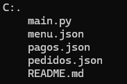

# Molipollito

MoliPollito es un restaurante que necesita un sistema para el gestinamiento de pedidos de cada mesa.

## Descripción 

MoliPollito cuenta con con cinco funciones:

1. **Realizar pedido**: Registra el nombre del cliente y los platos pedido guardando en categorias diferente.
2. **Consultar pedido**: Le mostrara el listorial del pedido del cliente.
3. **Cambiar estado de pedido**: El cliente podra cambiar el estado si cumple con las condiciones.
4. **Registrar pago**: Al registrar el pago el estado del cliente pasa a ser cancelado automaticamente.
5. **Cancelar pedido**: El pedido sera cancelado si el usuario no lo ha pagado.

## Estructura 

- *main.py*: Carpeta donde se registra el cogigo de la ejecución.
- *menu.json*: Json del menu del restaurante.
- *pagos.json*: Json donde se guarda el nombre del cliente, el total y fecha de pago.
- *pedidos.py*: Json donde se guarda los clientes y los item de cada plato pedido

## Lenguajes de uso  

  

## Instalación y uso 

1. Instalar visual code, git y python
2. Clonar repositorio
3. Ejecutar codigo 

## Créditos

Este proyecto fue elaborado por Zully Fernanda Ortiz Avendaño 
